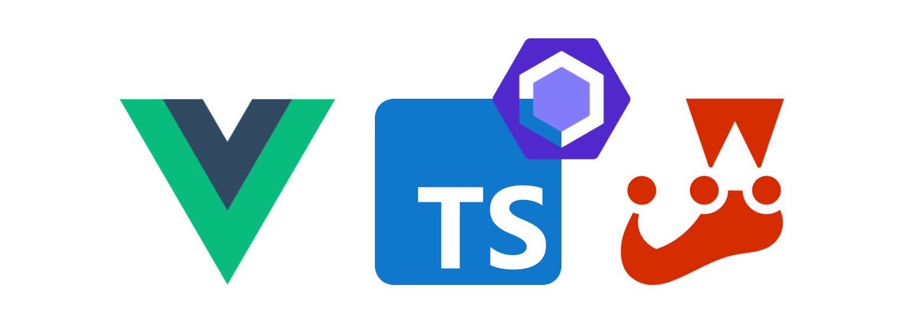

<div style="text-align:center" align="center">



# <span style="color: red">[COMPANY-NAME]</span>

Vue Starter Package integrated with Typescript and Eslint

Automated unit testing with Jest

Auto-generated documentation via Docsify

[](/templates/LICENSE.md)
[](https://v3.vuejs.org/)
[](https://www.typescriptlang.org/)
[](https://jestjs.io/en/)
[](https://docsify.js.org/#/)
[](https://github.com/Anivive/vue-package-starter)

</div> 


## Getting Started
### Install necessary dependencies for development
```
npm install
```

### Lints and fixes files
```
npm run lint
```

#### Initiate Test Suite
```
npm test
```

#### Serve Docs
```
npm run docs

visit -> http://localhost:3000
```


## Table of Contents

* [Getting Started](#getting-started)
* [Table of Contents](#table-of-contents)
* [What's in this Package?](#whats-in-this-package)
* [Testing](#testing)
* [Documentation](#documentation)
* [Contributing Guidelines](#contributing-guidelines)
* [Code Of Conduct](#code-of-conduct)
* [Bugs and Feature Requests](#bugs-and-feature-requests)
* [Copyright and License](#copyright-and-license)


## What's in this Package?

```
<package-name>
├── node_modules
├── src
│   └── main.ts
├── tests
│    └── unit
│        └── sum.js
│        └── sum.test.js
└── tsconfig.json
```


## Testing
To expand on the test suite, add your test files to the `/tests` directory, and Jest will
automatically pick them up.

To run your automated tests, run the commands below in your terminal:
```
cd <repo-name>

npm run test
```

[Jest Documentation](https://jestjs.io/docs/en/getting-started)


## Documentation
This package is set up to use Docsify, a documentation generator that creates a website portal for
you and your team to view all of your documentation automatically.

Your documentation README files are located in the `/docs` directory.
```
/docs/README.md                 ==> landing page for your documentation portal
/docs/_sidebar.md               ==> displays your documentation archictecture
/docs/changelog.md              ==> references your documentation updates
/docs/customization/            ==> example folder
/docs/getting_started/          ==> example folder
/docs/guides/                   ==> example folder
```

In order to view your documentation, run the commands below in your terminal:
```
npm i docsify-cli -g

cd <repo-name>

npm run docs
```

View your documentation at: `http://localhost:3000`

[Docsify Documentation](https://docsify.js.org/#/quickstart)

---


## Contributing Guidelines
Please read through our [contributing guidelines](CONTRIBUTING.md). Included are directions
for opening issues, coding standards, and notes on development.

Moreover, if your pull request contains JavaScript patches or features, you must include relevant
unit tests. All HTML and CSS should conform to the Code Guide, maintained by Mark Otto.

---


## Code Of Conduct
Please read through our [code of conduct](CODE_OF_CONDUCT.md).

---


## Bugs and Feature Requests
Found a bug or have a feature request? Please first read the issue guidelines and search for
existing and closed issues.

If your problem or idea is not addressed yet, please
[open a new issue](https://github.com/Anivive/vue-package-starter/issues).


## Thanks
Thank you to all of you who have contributed to this package.
[[Contribute to the Project](CONTRIBUTING.md)]


## Copyright and License
Code and documentation copyright <span style="color: red">[YEAR] [COMPANY-NAME]</span> Code released under the [MIT License](LICENSE.md).

Docs released under [Creative Commons](https://creativecommons.org/licenses/by/3.0/).

Please note that this project is released with a [Contributor Code of Conduct](CODE_OF_CONDUCT.md).
By participating in this project you agree to abide by its terms.


---


Status badges created using [Shields.io](https://github.com/badges/shields).
